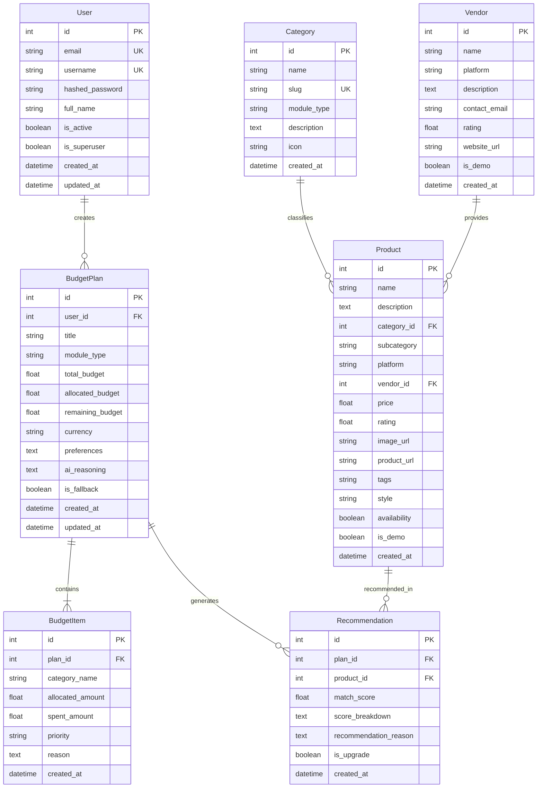

# PocketSmart AI - Database Architecture & Schema Specification

## Database Engine
- **Local Development:** SQLite (`sqlite:///./pocketsmart.db`)
- **Production Target:** PostgreSQL (via SQLAlchemy ORM abstraction)

---

## Entity Relationship Overview

---

## Seed Data Summary
Seeded via `python -m app.seed`:
- **7 Vendors**: IKEA (IKEA), Amazon India (Amazon), Flipkart (Flipkart), Swiggy (Swiggy), Zomato (Zomato), OYO (OYO), Local Heritage Crafts (Local).
- **22 Categories**:
  - *Home Interior (9)*: Bed, Sofa, Wardrobe, Table, Chair, Lighting, Curtains, Decor, Storage.
  - *Party / Event (7)*: Food, Venue, Decoration, Entertainment, Photography, Transportation, Miscellaneous.
  - *Jewelry (6)*: Necklace, Earrings, Bracelet, Ring, Pendant, Bangles.
- **33 Sample Products**: Realistic Indian Rupee (₹) pricing, clearly marked with `is_demo = True`.

---

## Provider Adapter Pattern
- `BaseRecommendationProvider`: Abstract interface for catalog lookups.
- `LocalCatalogProvider`: Concrete implementation querying the local database.
- `AmazonProvider`, `FlipkartProvider`, `IKEAProvider`, `SwiggyProvider`, `ZomatoProvider`, `OYOProvider`: Extensible adapter stubs for future affiliate / live API integrations.
